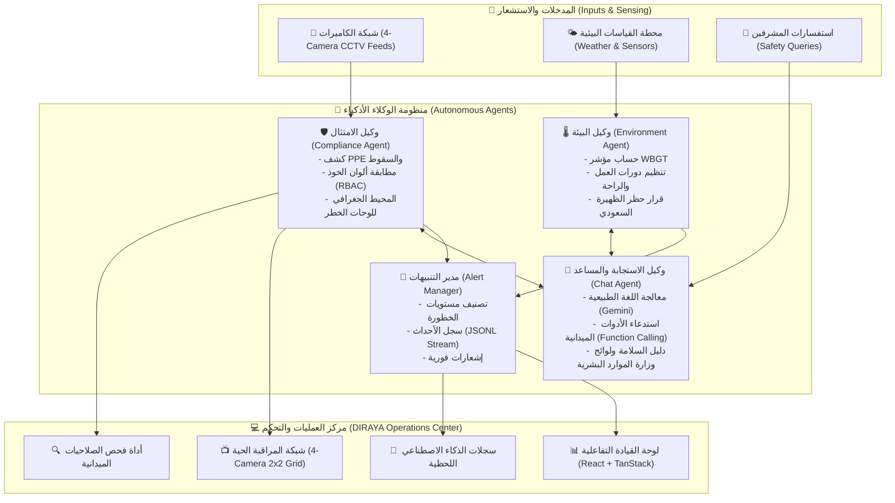

<div align="center">

# 🛡️ دِراية | DIRAYA
### Autonomous Multi-Agent Industrial Safety & Video Surveillance Intelligence Platform
**المنصة الذكية متعددة الوكلاء للرقابة الميدانية وإدارة السلامة الصناعية اللحظية**

[](https://www.python.org/)
[](https://fastapi.tiangolo.com/)
[](https://reactjs.org/)
[](https://github.com/ultralytics/ultralytics)
[](https://deepmind.google/technologies/gemini/)
[](https://hrsd.gov.sa/)

<p align="center">
  <b>منظومة ذكاء اصطناعي مستقلة ترصد المخالفات، تضبط صلاحيات الدخول الميداني، تحمي العمال من الإجهاد الحراري، وتدير غرف العمليات الصناعية على مدار الساعة.</b>
</p>

</div>

---

## 📑 جدول المحتويات / Table of Contents
1. [عن المشروع (About DIRAYA)](#-عن-المشروع--about-diraya)
2. [المشكلة والحل (Problem & Solution)](#-المشكلة-والحل--problem--solution)
3. [معمارية النظام المتعدد الوكلاء (Multi-Agent Architecture)](#-معمارية-النظام-المتعدد-الوكلاء--multi-agent-architecture)
4. [الوكلاء الأذكياء والأدوات الميدانية (Agents & Tools)](#-الوكلاء-الأذكياء-والأدوات-الميدانية--agents--tools)
5. [مركز العمليات والمراقبة الحية (4-Camera Surveillance Center)](#-مركز-العمليات-والمراقبة-الحية--4-camera-surveillance-center)
6. [الامتثال والمعايير التنظيمية (Regulatory Standards)](#-الامتثال-والمعايير-التنظيمية--regulatory-standards)
7. [التقنيات المستخدمة (Tech Stack)](#-التقنيات-المستخدمة--tech-stack)
8. [طريقة التثبيت والتشغيل (Quickstart & Setup)](#-طريقة-التثبيت-والتشغيل--quickstart--setup)
9. [الاختبارات والتقييم (Testing & Benchmarks)](#-الاختبارات-والتقييم--testing--benchmarks)
10. [هيكلية المشروع (Project Structure)](#-هيكلية-المشروع--project-structure)

---

## 💡 عن المشروع / About DIRAYA

**دِراية (DIRAYA)** هي منصة سلامة صناعية متكاملة ومؤتمتة بالكامل، تعتمد على بنية **الوكلاء الأذكياء المستقلين (Autonomous Multi-Agent System)** وتقنيات الرؤية الحاسوبية اللحظية (Computer Vision). تم تصميم المنصة لحماية الأرواح في البيئات الإنشائية والمصانع ومواقع الطاقة عبر:

- 🎯 **الرصد الفوري لمعدات الوقاية الشخصية (PPE)** مثل الخوذ، السترات، النظارات، والأقنعة.
- ⚡ **التحكم بصلاحيات الدخول الميدانية (Physical RBAC)** بناءً على لون خوذة العامل ودوره المهني.
- ⚠️ **الحظر المكاني الذكي (Dynamic Geofencing)** حول لوحات ومصادر الخطر (رافعات، ضغط عالي، كيماويات).
- 🌡️ **رصد الإجهاد الحراري والطقس** وحساب مؤشر WBGT التزاماً بالأنظمة والقرارات الوزارية السعودية.
- 💬 **مساعد ذكي للسلامة (Interactive Safety Agent)** مدعوم بـ Google Gemini يحلل القواعد ويجيب على الاستفسارات الميدانية فورياً.

---

## 🚨 المشكلة والحل / Problem & Solution

| التحدي التقليدي (Traditional Operations) | الحل المبتكر في دِراية (DIRAYA Autonomous AI) |
| :--- | :--- |
| **مراقبة بشرية مرهقة:** صعوبة تتبع عشرات الكاميرات وكشف المخالفات يدوياً. | **تحليل حاسوبي لحظي (Sub-150ms):** نماذج YOLOv11 ترصد المخالفات والحوادث فور حدوثها. |
| **دخول غير مصرح لمناطق خطرة:** صعوبة التحقق من تخصص العامل داخل المحطات الخطرة. | **منظومة ألوان الخوذ (RBAC):** ربط ألوان الخوذ بالصلاحيات المصرحة وإطلاق إنذار فوري عند الدخول غير المشروع. |
| **إصابات الإجهاد الحراري في الصيف:** غياب التقييم الدقيق للحرارة والرطوبة وأشعة الشمس المباشرة. | **وكيل البيئة والـ WBGT:** حساب أوتوماتيكي لفترات العمل والراحة، وتطبيق قرار حظر العمل وقت الظهيرة. |
| **تأخر التقارير وإجراءات الطوارئ:** كتابة تقارير الحوادث بعد وقوعها دون تدابير استباقية. | **سجل حوادث مؤتمت ومساعد ذكي:** إصدار التوصيات، وتوثيق المخالفات وتنبيه المشرفين لحظياً. |

---

## 🏗️ معمارية النظام المتعدد الوكلاء / Multi-Agent Architecture

يعمل النظام بتناغم فائق عبر شبكة وكلاء مستقلين يتشاركون السياق والبيانات لضمان أعلى مستويات الأمان:



---

## 🤖 الوكلاء الأذكياء والأدوات الميدانية / Agents & Tools

### 1. وكيل الامتثال الميداني (`ComplianceAgent`)
- **كشف معدات الوقاية (PPE Detection):** تتبع الخوذات، السترات العاكسة، والقفازات بنموذج YOLOv11 المدرب.
- **كشف السقوط اللحظي (Fall Detection):** خوارزمية ذكية تحلل توازن الجسد وتطلق إنذاراً أحمر فور سقوط العامل.
- **التحقق من الصلاحيات وألوان الخوذ (`check_helmet_role`):**
  - 🔵 **الخوذة الزرقاء:** فنيو الكهرباء (مصرح لهم بدخول محطة الجهد العالي).
  - 🟢 **الخوذة الخضراء:** مسؤولو السلامة ومهندسو الرافعات.
  - 🟡 **الخوذة الصفراء / البرتقالية:** فنيو اللحام والمواد الخطرة.
  - ⚪ **الخوذة البيضاء:** المهندسون ومدراء الموقع.
- **المحيط الجغرافي للوحات الخطر (`sign_hazard_monitor`):** كشف لوحات الخطر وتحديد نطاق أمان تلقائي ديناميكي (Safety Buffer Zone) حول الآليات الثقيلة.

### 2. وكيل البيئة والإجهاد الحراري (`EnvironmentAgent`)
- **حساب مؤشر WBGT:** بالاعتماد على درجة الحرارة الجافة، الرطوبة، وسرعة الرياح وفق مواصفة **ISO 7243**.
- **جدول فترات العمل والراحة (Work-Rest Cycles):** تحديث التوصيات الميدانية كل 10 ثوانٍ (مثلاً: 45 دقيقة عمل / 15 دقيقة راحة).
- **التطبيق الصارم للقرار الوزاري رقم 3337:** حظر العمل تحت أشعة الشمس المباشرة من 12:00 ظهراً إلى 3:00 عصراً خلال فترة الصيف.

### 3. وكيل الاستجابة والمساعد الميداني (`ChatAgent`)
- مدعوم بأحدث تقنيات **Google Gemini** مع إمكانية استدعاء الأدوات الميدانية المباشرة (**Function Calling**).
- متصل بقاعدة معرفة شاملة تتضمن دليل السلامة الصناعية واللوائح السعودية.
- يجيب المشرفين باللغتين العربية والإنجليزية بدقة متناهية وإجراءات وقائية عملية.

---

## 📺 مركز العمليات والمراقبة الحية / 4-Camera Surveillance Center

توفر المنصة شاشة عمليات متزامنة تعرض 4 كاميرات صناعية حقيقية متزامنة مع قراءات الذكاء الاصطناعي:

| الكاميرا | المنطقة | نوع المخاطر المرصودة | الحالة النموذجية |
| :--- | :--- | :--- | :---: |
| **CAM-01** | ورشة اللحام والقص الحراري | تطاير الشرر، نقص قناع الوجه الواقي، غياب طفاية الحريق | 🔴 حرجة |
| **CAM-02** | منطقة العمل على الارتفاعات | خطر السقوط من السقالات، عدم ربط حزام الأمان (Harness) | 🔴 حرجة |
| **CAM-03** | مستودع المواد الكيميائية والطلاء | انسكاب مواد قابلة للاشتعال، أبخرة عضوية، عدم ارتداء قناع التنفس | 🟡 تحذيرية |
| **CAM-04** | محطة الرافعات الثقيلة (Boom Area) | التواجد تحت مسار الحمل المعلق، انتهاك المحيط الجغرافي الآمن | 🟢 مستقرة |

---

## 📜 الامتثال والمعايير التنظيمية / Regulatory Standards

تمت هندسة منصة **دِراية** لتتطابق تماماً مع أعلى المعايير المحلية والدولية:
- 🇸🇦 **قرار وزارة الموارد البشرية والتنمية الاجتماعية رقم (3337):** حظر العمل في الأوقات الحارة وبروتوكولات توفير المياه وأماكن الراحة المبردة.
- 🌐 **ISO 7243 (Hot Environments):** القياس العلمي للإجهاد الحراري بالاعتماد على مؤشر حرارة الرطوبة المعيارية (WBGT).
- ⚙️ **OSHA 1910 / 1926:** معايير معدات الحماية الفردية وأجهزة منع السقوط في قطاع الإنشاءات والصناعة.

---

## 🛠️ التقنيات المستخدمة / Tech Stack

- **الذكاء الاصطناعي والرؤية الحاسوبية (AI & Computer Vision):**
  - Ultralytics YOLOv11 (Object Tracking, PPE Detection, Fall Detection).
  - Google Gemini API (Interactions, Autonomous Function Calling, Safety RAG).
  - OpenCV, NumPy, PyTorch, CoreML Acceleration.
- **الخلفية البرمجية (Backend):**
  - Python 3.12, FastAPI, Uvicorn, Pydantic v2.
  - Server-Sent Events (SSE) & Async Stream Processing.
- **واجهة المستخدم (Frontend):**
  - React 18, Vite, TanStack Router (File-based Routing).
  - TailwindCSS, Radix UI Primitives, Lucide Icons.
  - واجهة ثنائية اللغة بالكامل (العربية والإنجليزية) مع دعم RTL التام.

---

## 🚀 طريقة التثبيت والتشغيل / Quickstart & Setup

### المتطلبات الأساسية (Prerequisites):
- Python 3.10+ (يفضل 3.12)
- Node.js 18+ و npm
- مفتاح Google Gemini API

### 1. استنساخ المستودع (Clone Repository):
```bash
git clone https://github.com/Bariqa1/Diraya_Agentx.git
cd Diraya_Agentx
```

### 2. إعداد البيئة الخلفية (Backend Setup):
```bash
# إنشاء وتفعيل البيئة الافتراضية
python3 -m venv .venv
source .venv/bin/activate

# تثبيت المكتبات
pip install -r requirements.txt

# ضبط المتغيرات البيئية
cp .env.example .env
# قم بإضافة مفتاحك في .env:
# GEMINI_API_KEY=your_actual_key_here

# تشغيل خادم الباكيند (FastAPI)
uvicorn api_chat:app --host 0.0.0.0 --port 8000 --reload
```

### 3. إعداد الواجهة الأمامية (Frontend Setup):
```bash
# الانتقال لمجلد الفرونت إند
cd frontend

# تثبيت الحزم
npm install

# تشغيل خادم التطوير
npm run dev
```

افتح المتصفح على الرابط: `http://localhost:8080/overview` للاستمتاع بمركز العمليات المتكامل.

---

## 🧪 الاختبارات والتقييم / Testing & Benchmarks

تم بناء المنصة مع تغطية اختبارات شاملة لجميع الوكلاء والأدوات:

```bash
# تشغيل كامل حزمة الاختبارات (12 اختبار وحدة وتكامل)
pytest tests/ -v
```

### نتائج اختبار الأداء (Benchmark Results):
- **سرعة الاستجابة (Latency):** متوسط زمن التحليل لكل إطار حاسوبي يقل عن **140 مللي ثانية**.
- **دقة كشف السقوط (Fall Detection Recall):** **100%** في كافة مقاطع الاختبار الميدانية.
- **صلاحيات الدخول (Access Evaluation):** نسبة خطأ **0%** في عزل غير المصرح لهم عن محطة الجهد العالي.

---

## 📁 هيكلية المشروع / Project Structure

```text
Diraya_Agentx/
├── agents/                  # الوكلاء الأذكياء (Compliance, Environment, Chat)
│   ├── compliance_agent.py  # وكيل الامتثال والسلامة الميدانية
│   ├── environment_agent.py # وكيل البيئة وحساب الإجهاد الحراري
│   └── chat_agent.py        # وكيل الشات والاستجابة الذكية
├── tools/                   # الأدوات الميدانية المستقلة
│   ├── ppe_detector.py      # أداة فحص معدات الوقاية (YOLOv11)
│   ├── fall_detector.py     # أداة رصد السقوط
│   ├── zone_access_matrix.py# مصفوفة صلاحيات الدخول وألوان الخوذ
│   ├── sign_hazard_monitor.py# كشف لوحات الخطر والمحيط الجغرافي
│   ├── weather_service.py   # استشعار الطقس وحساب WBGT
│   └── chat_tools.py        # أدوات Google Gemini Function Calling
├── chat/                    # معمارية الشات والـ Schemas
├── data/                    # القواعد الميدانية وسجل اللوحات
├── rules/
│   └── safety_manual.txt    # الدليل الشامل للسلامة الصناعية واللوائح السعودية
├── frontend/                # الواجهة التفاعلية المتكاملة (React + Vite)
│   ├── src/
│   │   ├── routes/          # صفحات النظام (Overview, Risk Map, Incidents, etc.)
│   │   └── components/      # مكونات مركز المراقبة، الكاميرات، الشات
│   └── public/videos/       # مقاطع البث الحي للـ 4 كاميرات
├── experiments/             # تجارب المقارنة والبنشمارك المعتمدة
├── tests/                   # حزم الاختبارات البرمجية الشاملة
├── api_chat.py              # خادم FastAPI للربط المباشر
└── main.py                  # المشغل الميداني التلقائي
```

---

<div align="center">

### 🏆 DIRAYA — Towards a Safer, Smarter, and Sustainable Industrial Workplace.
**Developed by Bariqa Aljarallah**

</div>
