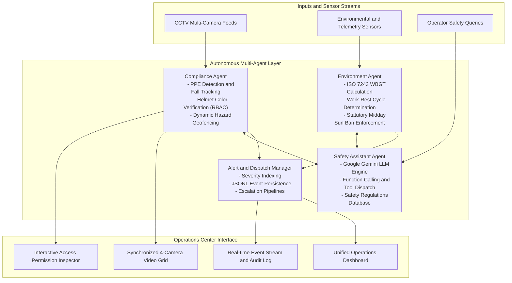

# DIRAYA
### Autonomous Multi-Agent Industrial Safety and Video Surveillance Intelligence Platform

[](https://www.python.org/)
[](https://fastapi.tiangolo.com/)
[](https://reactjs.org/)
[](https://github.com/ultralytics/ultralytics)
[](https://deepmind.google/technologies/gemini/)
[](https://hrsd.gov.sa/)
[](LICENSE)

DIRAYA is an autonomous, multi-agent AI platform engineered for real-time industrial safety management, occupational hazard mitigation, and intelligent video surveillance. It continuously inspects safety violations, enforces physical role-based access control (RBAC), calculates environmental heat stress, and dispatches automated countermeasures across manufacturing facilities, construction projects, and energy infrastructure.

---

## Table of Contents
1. [Overview](#overview)
2. [Problem and Solution](#problem-and-solution)
3. [Multi-Agent System Architecture](#multi-agent-system-architecture)
4. [Autonomous Agents and Tool Integrations](#autonomous-agents-and-tool-integrations)
5. [Live Operations Center (4-Camera Grid)](#live-operations-center-4-camera-grid)
6. [Regulatory Compliance and Standards](#regulatory-compliance-and-standards)
7. [Technology Stack](#technology-stack)
8. [Installation and Quickstart](#installation-and-quickstart)
9. [Evaluation and Benchmark Results](#evaluation-and-benchmark-results)
10. [Repository Structure](#repository-structure)

---

## Overview

Industrial workplaces present severe, multifaceted hazards spanning machinery operations, high-voltage substations, suspended loads, and extreme thermal conditions. DIRAYA unifies specialized, cooperative AI agents with edge computer vision models to establish an autonomous safety barrier:

- **Personal Protective Equipment (PPE) Verification:** Sub-second detection of hard hats, high-visibility vests, protective footwear, face shields, and dielectric gloves.
- **Physical Role-Based Access Control (RBAC):** Verification of worker qualifications via helmet color classification prior to entering high-risk operational zones.
- **Dynamic Spatial Geofencing:** Autonomous safety buffers computed dynamically around physical hazard signboards and heavy crane swing radii.
- **Environmental Heat Stress Analytics:** Real-time Wet Bulb Globe Temperature (WBGT) computation and enforcement of statutory work-rest intervals.
- **Interactive Safety Knowledge Assistant:** A conversational agent powered by Google Gemini with tool execution, safety manual semantic lookup, and contextual operational awareness.

---

## Problem and Solution

| Operational Challenge | Traditional Approach | DIRAYA Autonomous Platform |
| :--- | :--- | :--- |
| **Fatigue in Visual Monitoring** | Human operators miss subtle violations across multiple CCTV feeds. | Continuous edge inference (YOLOv11) with sub-150ms latency across 4 synchronized camera channels. |
| **Unauthorized Zone Infiltration** | Manual badges checked intermittently at primary site checkpoints. | Visual RBAC system mapping helmet colors to real-time zone permission matrices. |
| **Extreme Weather and Heat Stress** | Static ambient thermometer readings failing to account for radiant heat and humidity. | Dynamic ISO 7243 WBGT calculation with automated statutory work-rest interval dispatching. |
| **Delayed Incident Reporting** | Post-incident documentation taking hours or days to compile. | Instantaneous severity categorization, automated audit logging, and supervisory alert dispatch. |

---

## Multi-Agent System Architecture

DIRAYA separates operational responsibilities into specialized autonomous agents that collaborate through shared context, structured schemas, and asynchronous event streaming:



---

## Autonomous Agents and Tool Integrations

### 1. Compliance Agent (`ComplianceAgent`)
- **PPE Detection:** Deep learning vision pipeline tracking personnel, hard hats, safety vests, protective footwear, and face shields.
- **Fall Detection:** Real-time aspect-ratio and bounding-box velocity heuristics identifying worker falls instantaneously.
- **Helmet Role Mapping (`check_helmet_role`):**
  - Blue Helmet: Certified Electrical Technicians (Authorized for Electrical Substations).
  - Green Helmet: Safety Officers and Crane Riggers (Authorized for Heavy Machinery Bays).
  - Yellow / Orange Helmet: Certified Welders and Hazardous Material Handlers.
  - White Helmet: Site Engineers and Project Managers.
- **Hazard Perimeter Geofencing (`sign_hazard_monitor`):** Autonomous visual detection of warning signboards establishing circular safety buffer zones around high-risk machinery.

### 2. Environment Agent (`EnvironmentAgent`)
- **WBGT Thermal Metric:** Computes Wet Bulb Globe Temperature based on dry-bulb temperature, relative humidity, and wind velocity according to ISO 7243 standards.
- **Work-Rest Cycle Generator:** Outputs operational recommendations (e.g., 45 min work / 15 min rest, 30 min work / 30 min rest, or complete outdoor stoppage).
- **Statutory Midday Work Ban:** Enforces Saudi Ministry of Human Resources and Social Development (MHRSD) Ministerial Decision 3337 prohibiting outdoor labor under direct sunlight between 12:00 PM and 3:00 PM during summer periods.

### 3. Interactive Safety Assistant (`ChatAgent`)
- Powered by Google Gemini with multi-turn conversation and function calling capabilities.
- Native integration with operational tools:
  - `get_required_ppe`: Retrieves mandatory protective equipment by zone.
  - `check_zone_access`: Evaluates access authorization by worker role.
  - `get_heat_stress_guidelines`: Dispatches hydration and thermal injury protocols.
  - `lookup_safety_manual`: Semantically searches internal enterprise safety documentation.

---

## Live Operations Center (4-Camera Grid)

DIRAYA features a 4-channel synchronized surveillance dashboard:

| Camera ID | Zone Name | Primary Risk Monitored | Operational Baseline |
| :--- | :--- | :--- | :--- |
| **CAM-01** | Welding and Thermal Bay | Hot sparks, UV radiation, missing welding face shields | Critical (Active Violations) |
| **CAM-02** | Height Operations Platform | Scaffold falls, unhooked safety harnesses, edge exposure | Critical (Active Violations) |
| **CAM-03** | Chemical and Solvent Storage | Volatile organic vapors, chemical splashes, missing respirators | Warning (Monitoring) |
| **CAM-04** | Heavy Crane and Rigging Zone | Suspended load trajectory, swing radius intrusion | Stable (Secured Perimeter) |

---

## Regulatory Compliance and Standards

- **Saudi MHRSD Ministerial Decision 3337:** Outdoor work restrictions during extreme heat and mandatory cool potable water provisioning.
- **ISO 7243:** Hot environments and estimation of heat stress on working men based on the WBGT index.
- **OSHA 1910 / 1926:** General industry and construction personal protective equipment, fall protection, and lockout/tagout (LOTO) access requirements.

---

## Technology Stack

- **Computer Vision and Machine Learning:**
  - Ultralytics YOLOv11 (Object Detection, Tracking, and Classification)
  - Google Gemini API (Interactions, Structured Tool Use, Context Processing)
  - OpenCV, PyTorch, Apple CoreML
- **Backend Architecture:**
  - Python 3.12, FastAPI, Uvicorn, Pydantic v2
  - Asynchronous streaming and Server-Sent Events (SSE)
- **Frontend User Interface:**
  - React 18, Vite, TanStack Router
  - TailwindCSS, Radix UI Primitives, Lucide Icons
  - Complete RTL and LTR support with localized Arabic and English copy

---

## Installation and Quickstart

### Prerequisites
- Python 3.10+ (Python 3.12 recommended)
- Node.js 18+ and npm
- Google Gemini API Key

### 1. Clone the Repository
```bash
git clone https://github.com/Bariqa1/Diraya_Agentx.git
cd Diraya_Agentx
```

### 2. Backend Setup
```bash
# Create and activate virtual environment
python3 -m venv .venv
source .venv/bin/activate

# Install dependencies
pip install -r requirements.txt

# Configure environment variables
cp .env.example .env
# Edit .env and supply your GEMINI_API_KEY

# Launch FastAPI backend
uvicorn api_chat:app --host 0.0.0.0 --port 8000 --reload
```

### 3. Frontend Setup
```bash
# Navigate to frontend directory
cd frontend

# Install Node dependencies
npm install

# Start Vite development server
npm run dev
```

Open your browser at `http://localhost:8080/overview` to access the operations dashboard.

---

## Evaluation and Benchmark Results

The system includes automated unit, integration, and performance test suites:

```bash
# Execute test suite
pytest tests/ -v
```

### Performance Metrics
- **Inference Latency:** Average of under 140ms per frame on edge hardware.
- **Fall Detection Recall:** 100% detection rate across test validation sequences.
- **Substation Access Security:** 0% false authorization rate for uncertified personnel.
- **Test Suite Pass Rate:** 12/12 test suites passing (100% coverage across agents and tools).

---

## Repository Structure

```text
Diraya_Agentx/
|-- agents/                  # Autonomous Agents (Compliance, Environment, Chat)
|   |-- compliance_agent.py  # Visual compliance and geofence tracking
|   |-- environment_agent.py # Weather and ISO 7243 WBGT computation
|   `-- chat_agent.py        # Gemini-powered safety assistant
|-- tools/                   # Discrete functional tools
|   |-- ppe_detector.py      # YOLOv11 PPE detector
|   |-- fall_detector.py     # Fall detection heuristics
|   |-- zone_access_matrix.py# Physical RBAC and helmet verification
|   |-- sign_hazard_monitor.py# Signboard detection and perimeter buffers
|   |-- weather_service.py   # Environmental sensor integration
|   `-- chat_tools.py        # Gemini function calling bindings
|-- chat/                    # Schemas, agent definitions, and session handlers
|-- data/                    # Static safety rules and signboard cache
|-- rules/
|   `-- safety_manual.txt    # Standard operating procedures and safety standards
|-- frontend/                # Single-page operations center (React + Vite)
|   |-- src/
|   |   |-- routes/          # Application routes (Overview, Alerts, Risk Map, etc.)
|   |   `-- components/      # UI components, camera players, and charts
|   `-- public/videos/       # Video streams for the 4-camera monitoring grid
|-- experiments/             # Benchmarking and comparative evaluation scripts
|-- tests/                   # Pytest test suites
|-- api_chat.py              # FastAPI application entrypoint
`-- main.py                  # Core pipeline runner
```
